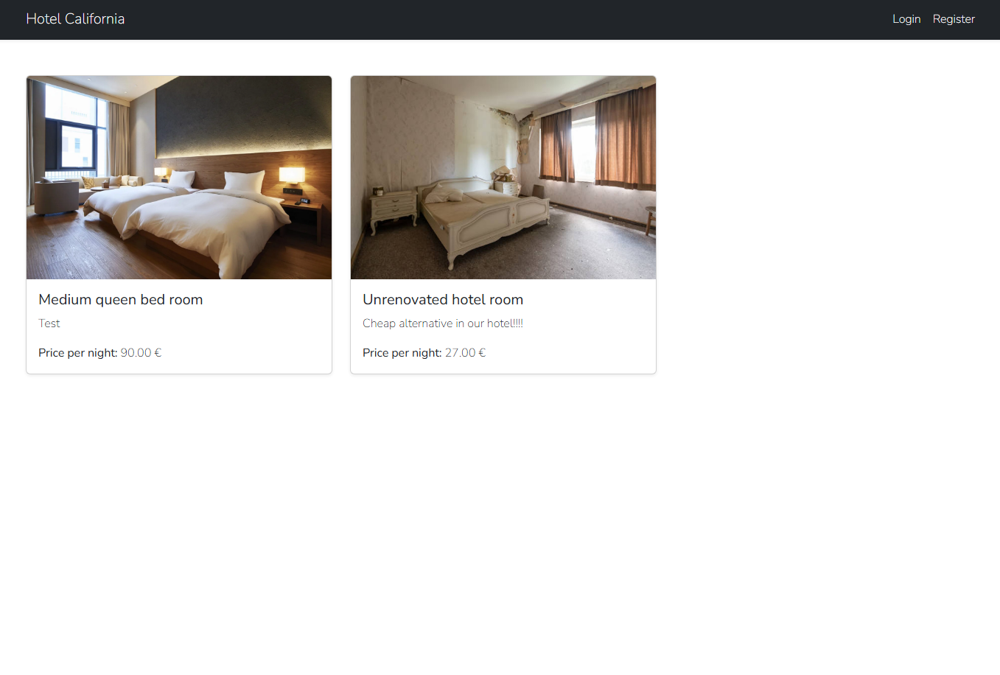
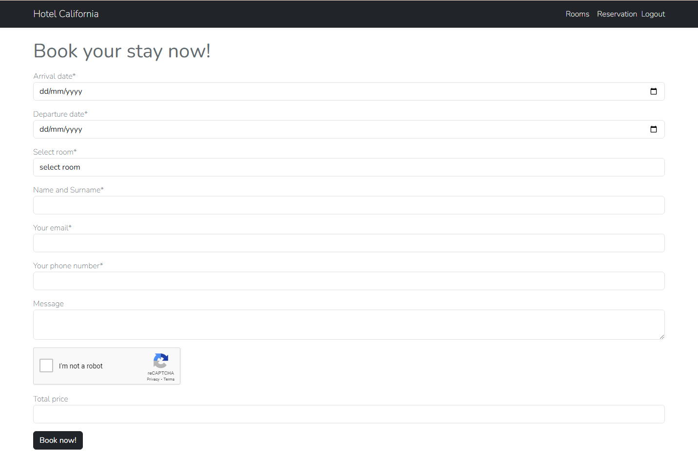

### This is the exam for HumanFrog 1.12.2024!

In this project I used Laravel 7 with PHP 7.3.

Home page:

Users can login and register their account the amount of pages they can access on it depends on if they are logged in or not.

This is the rooms tab where we can see all listed rooms and their prices 

If we hover and click we can make a reservation (same page as on the home page)

This is the Booking page! (only registered and logged users can make a booking)

Each instance of wrong input gives different error msg also there is google captcha v2 to check if ur not a robot.

Example of booking without correct data:

After making a succesful booking both Hotel and user receive a mail using Mailtrap services.

and for hotel:

### Admin system
If user is admin he has access to edit rooms and see all the booking made to date.
(for testing purpuses the admin user is admin@admin.com with password "adminadmin")
When logged in the admin will see the admin panel tab.

Here on click he can see the rooms on click of a room a edit modal will open.

Here he can change the data of this room for this example we can set the price to 100$

Admin can also go to reservation tab where he as access to all the reservations/bookings that have been made.

---------------------------------------------------
### Setup

- Laravel 7 with PHP 7.3
- Clone the github repo
- Configure mysql database inside .env
- run php artisan migrate or (download my premade .sql file and import)
- Add mailing data inside .env also add google captcha v2 keys
- After that run php artisan serve 

---------------------------------------------------
### Test data

Inside premade sql file u already have 2 users created.

- admin@admin.com (pass: "adminadmin")
- test@test.com (pass: "testtest")

Test user is non admin user Admin user is Admin user